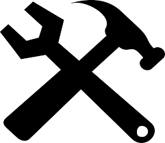

Data editing
=============

|todo| You have a permit to execute a borehole with the condition to return the data to administration. For this reason you want to insert into the BDMS the data from the following geological report:

:download:`Geological report <../pdf/BIR19Courrendlin.pdf>`

1. Enter editing mode
----------------------

To enter the **editor mode** you have to select it from the upper right menu (area 4) as specified in the :doc:`interface section <interface>`.

Once entered in **editor mode** on the bottom left you see four buttons:

- **refresh**: it permits to refresh the table rows
- **reset**: it permits to reset the entered filter to the initial status
- **upload**: it permits to upload a simple CSV with 3 columns ("east, north, name") to bulk create new boreholes
- **new**: it permits to create a new borehole from scratch

.. thumbnail:: ../images/editor_actions.png
    :width: 40%
    :align: center

2. Creating a new borehole
---------------------------

Select the **new** button and chose the **workgroup** where you desire to add new data.

.. note::
    Workgroups are isolated collections of boreholes, often belonging to the same project. Each user can be a member of one or more **workgroup** and having different authorization level for each of them. 
    For more information please see the :doc:`authorization section <qc>`.

.. thumbnail:: ../images/new_bore.png
    :width: 40%
    :align: center

Once the workgroup has been selected you'll enter in the **data editing** of the newly created borehole. On the left side you'll see three different data sections:

- **Location**: this section host the basic metadata (names, restrictions) and the borehole location (coordinates, address)
- **Borehole**: this section host the borehole specific technical metadata like inclinations, diameters, depth, top bedrock, etc.
- **Stratigraphy**: this section host the stratigraphy as a results of a sequence of layers with their own specific characterizations (lithology, listratigraphy, etc..)

.. note::
    Before entering the data the user has to activate the editing by pressing the *start editing* button at the bottom right corner of the application.

3. Location data section
-----------------------------------

The red fields are strictly mandatory to physically create the borehole in the database while fields with asterisks (*) are mandatory according to the data model. All the other fields are optional.

.. thumbnail:: ../images/location_data.png
    :width: 100%
    :align: center

As soon as data are entered they are stored in the system so there is no need to save your edits. Moreover, strictly mandatory fields are no more displayed in red.

.. thumbnail:: ../images/location_data2.png
    :width: 100%
    :align: center

4. Borehole data section
--------------------------

In this section there are technical details of the borehole. Strictly mandatory fields to complete a stratigraphy are: *Total depth*, *Top bedrock*, *Lit/Pet Top bedrock* and *Litstrati top bedrock*.

.. thumbnail:: ../images/borehole_data.png
    :width: 100%
    :align: center

Note that when you want to enter *Lit/Pet Top bedrock*, *Litstrati top bedrock* and *Chronostrati top bedrock* a specific window will pop up. This window permits to navigate the hierarchical structure of the data in the left side part by selecting different nested classes. Optionally, the *Filter by name* field enable direct search of known names.

.. thumbnail:: ../images/lit_data2.png
    :width: 60%
    :align: center

Entering the data you find in the *Geological report* you should have the following result.

.. thumbnail:: ../images/borehole_data2.png
    :width: 100%
    :align: center

5. Stratigraphy data section
------------------------------

Selecting the stratigraphy data section a button to add a first stratigraphy is shown. Create a stratigraphy and give it a name and date.

.. note::
    Immediately you'll see en error message saying *"Missing bedrock"*. This is because there is an automatic data validation that highlights inconsistencies and errors. If you click on the *wrench* icon on the left of the message you'll get a support to fix it: either proposing a solution or indicating an action.

As shown in the animation below, add a bedrock and then fill the *Base MD* field of the layer as suggested to the total depth of the borehole.

.. thumbnail:: ../images/stratigraphy.gif
    :width: 100%
    :align: center

Now, we are missing all the other layers! Using the add layer button add all the layers according to your stratigraphy (see the *Geological report* on top of this page) and fill all the relevant fields.

.. thumbnail:: ../images/add_layer.gif
    :width: 100%
    :align: center

A data gap from the first layer to the bedrock still exists, so a warning is displayed! Fill in the gap, adding the layers from the geological interpretation.

Fill in with your notes / comments your work (arrow 1) and submit the entered data for a **Scientific check** (arrow 2).

.. thumbnail:: ../images/submit_data.png
    :width: 100%
    :align: center

.. note::
    Since the bedrock in the interpretation is composed by several layers we should correct the *Malm des Juragebirges* layer adjusting the *Base MS* level and adding the other layers.

